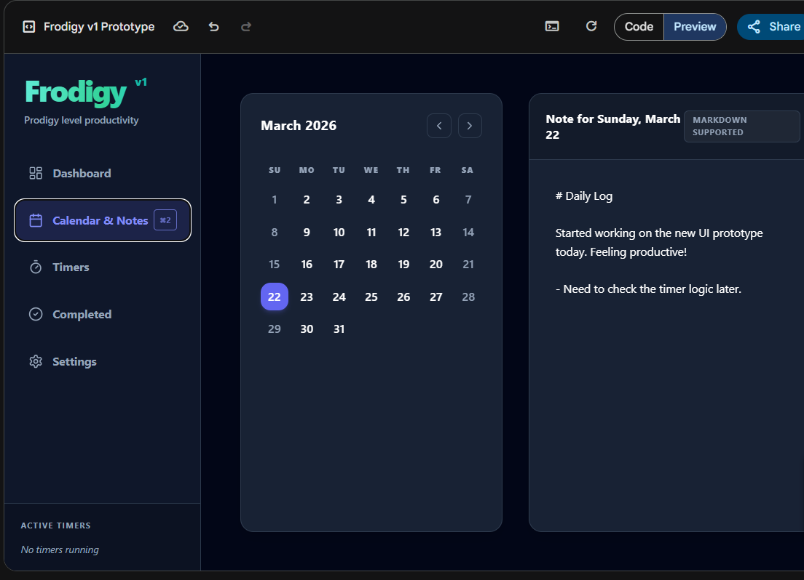

# Frodigy



**Frodigy** is a beautiful, offline desktop productivity application built on Electron, Node.js, and Vanilla JavaScript. It is designed to act as your personalized, distraction-free command center for modern work sessions.

## 🚀 Features

- **Dashboard**: Track your daily routines and outstanding one-time tasks.
  - Custom-interval recurring tasks that auto-refresh based on your habits.
  - Subtask support for larger projects.
- **Calendar & Daily Notes**: Never miss a beat with a visual calendar grid hooked up to an offline memory system.
  - Distraction-free full-screen editor mode (`⤢`).
  - Secure offline `.md` parsing using `marked.js` with A-/A+ accessibility zoom features.
- **Advanced Timers**: Keep yourself accountable with custom multi-timers based on the native Web Audio API.
  - "Sticky" un-ignorable popup modals that force you to manually dismiss alarms.
  - Seamless fallback mechanisms for custom user audio (place a `custom-alarm.mp3` in the app directory for personalized sounds!).
- **Statistics & Summaries**: Your very own productivity tracker automatically logging completed tasks and historical focus sessions.
- **Dynamic Themes**: Fully equipped design system with easy switching between Neon Abyss, Royal Indigo, and High Contrast.

## 🛠️ Technologies Used

- **Electron** (v35.x LTS)
- **Node.js** (Vanilla JS with isolated contexts)
- **better-sqlite3** for lightning-fast, zero-configuration local persistence.
- **marked** for reliable, offline markdown rendering.

## 📦 Setup & Installation

### Running Locally
To run this application locally from the source code:

1. Clone the repository:
   ```bash
   git clone https://github.com/UnEliteFish52/frodigy.git
   cd frodigy
   ```
2. Install dependencies:
   ```bash
   npm install
   ```
3. Start the application:
   ```bash
   npm start
   ```

### Building the Executable
To package the app into a standalone Windows `.exe`:
```bash
npm run dist
```
The resulting executable will be available inside the generated `dist/` directory.

## 🔒 Data Privacy
Because Frodigy is an offline-first desktop application, your task records, calendar notes, and timer statistics *never* leave your local machine. All data is securely persisted inside the `frodigy.db` SQLite database file in the project's root folder.

---
*Created by UnEliteFish52 as a personal productivity ecosystem.*
